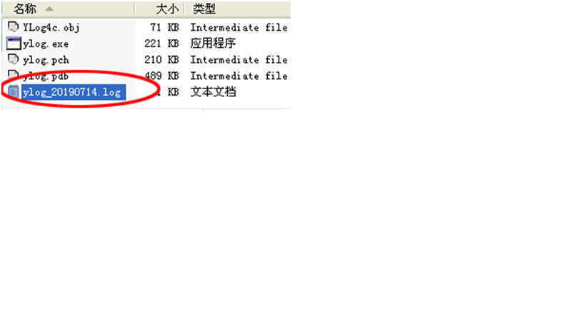

# YLog4C通用C++日志类  

## 总则
### 说明
这是一个通用的C++日志类，已在Windows、Linux和Arm Linux平台下用于多个实战项目。

### 编译
本类代码独立使用，只有一个cpp和一个h文件，不依赖其他第三方库和文件。基本上只需把文件加到工程即可直接编译使用，偶尔有编译不过的，也只是头文件包含问题，修改对应包含即可。

### 声明
这是laody完全自主开发的代码，若有问题或建议，请联系Email：laody@163.com

## 使用方法
### 首次使用
Laody认为一个好工具类的使用应该是“拿来就用，用完不管”，YLog4C类也依据此原则，没有任何多余步骤，包含YLog4c.h，直接使用：  

	#include "stdafx.h"  
	#include "YLog4c.h"  
	int main(int argc, char* argv[])  
	{  
	  YLog4C log;  
	  log.Debug("Hello World!\n");  
	  return 0;  
	}

编译运行后，直接在运行目录创建log文件：  

程序同时在控制台和日志文件输出如下内容：  

	  [07:29:38 <DBG>ylog.cpp#10] Hello World!

如在Linux或其他非Visual C++环境，请在工程目录创建stdafx.h文件，内容可为空。

### 默认行为
程序默认行为如下所示，可调用接口进行个性化设置，设置立即生效。  

1. 日志路径为程序运行目录。
2. 日志文件名格式：目录+应用程序名称+“_"+日期+".log"，应用程序名称为运行文件名，从首个“-”符号截断，如“ylog-v1.0”将截断为“ylog”。  
3. 每个日志文件最大100M，超过此尺寸，原文件更换为“xxxx_N.log”（N为从1递增的整数），并建立新的日志文件。
4. 每天最多4个日志文件，超过此数量，自动删除后缀最大的日志文件。

### 调用接口

1. 按日志级别由高到低，分别有Fatal、Error、Warn、Info、Debug和Buff六个调用接口，除Buff接口调用格式固定外，其他接口均与printf函数相同，采用可变参数格式。
2. 低于当前已设置级别的调用不会输出任何内容，比如假设系统正常上线运行后，设置了级别为Info，则高于此级别的Fatal、Error、Warn、Info调用会输出，而低于此级别的Debug和Buff被屏蔽，不输出任何内容。
3. 日志输出的日期通常已在文件名体现，因此日志行只按时分秒格式输出时间。Info调用输出的格式是“hh:mm:ss <INF>日志内容”，其他调用在日志内容前插入调用点的源文件名称和行数，方便问题定位。
4. 为了能插入文件名和行数，调用实际采用宏定义方式，因此虽然类定义了LogBuff等公共函数，但请不要直接调用，而是调用前面描述的六个输出调用接口。

### 个性化设置

#### 说明

* YLog4C不需任何设置就能工作的很好，实际上，笔者通常在项目中只做日志文件目录和日志级别两种设置。
* 个性化设置函数是静态成员函数，更改类的静态全局变量，立即生效，因此可以在系统运行过程中动态更新日志的行为。

#### 设置应用程序名称

	  static void YLog4C::SetLogAppname(const char *lpszAppname); 
参考上述默认行为。

#### 设置日志文件目录

	static void YLog4C::SetLogDir(const char *lpszDir);
YLog4C默认将日志文件放到运行目录。实际项目中，特别是Linux服务项目，通常需要放到一个指定的目录，方便日志的统一管理和定时清理。

#### 设置日志文件的最多个数

	static void YLog4C::SetLogFileMaxcnt(int n);
设置日志文件的最多个数,如每天一个文件,则设置每天最多个数

#### 设置是否输出到控制台
	static void YLog4C::SetLog2Console(bool b);
* 从控制台运行程序时，YLog4C默认同时输出日志到控制台和文件，控制台关闭后，若程序未退出（如以后台方式运行程序）,YLog4C自动关闭到控制台的输出，减少不必要的系统调用。以服务方式运行程序时，YLog4C也会自动关闭到控制台的输出。
* 绝大多数情况下，不需要显式调用本设置。

#### 设置是否输出到文件
	static void YLog4C::SetLog2File(bool b); 

设置输出或不输出日志到文件。

#### 设置是否输出到函数
	static void YLog4C::SetLog2Func(LOG4C_FUNC pFunc);
* 以回调函数的方式将日志内容输出到其他的处理流程。
* 请务必注意，因为几乎没在实际项目中用过，该功能未经过测试，特别是日志内容很大时，可能会造成缓冲区溢出，请谨慎调用。

#### 设置日志级别
	static void YLog4C::SetLogLevel(int n); 
请参考前述调用接口章节。

#### 设置是否每天一个文件
	static void YLog4C::SetLogDiary(bool b); 

#### 设置日志文件最大长度
	static void YLog4C::SetLogMaxsize(int n);  
设置日志文件最大长度 100K<n<2G,默认100M

#### 设置是否打印线程ID
	static bool YLog4C::SetLogThreadID(bool b); 
设置是否打印线程ID,默认不打印。

#### 设置是否实时刷新
	static bool YLog4C::SetFlushRT(bool b);
设置是否实时刷新。为保证日志内容不缺失，YLog4C默认每个日志调用都刷新文件。如果程序的负荷很重，或者日志量庞大，关闭实时刷新可有效减少系统负荷。这种情况下若程序崩溃，操作系统缓存到内存的数据可能未实际写到文件，导致关键日志的缺失。

